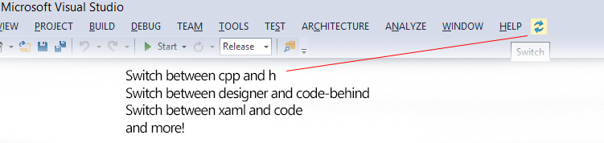

Switch
======

Switch is an Addin for Visual Studio that lets you quickly switch between related files, such as *.cpp and *.h or XAML and code-behind.

Switch is an extension for Visual Studio that allows you to switch between C++ source and header files, WinForms code and designer, XAML and codebehind and more. With one button press, or keyboard shortcut, you can easily flick between related files.

Installation for Visual Studio 2008, 2010, 2012
-----------------------------------------------

Download the MSI installer from the releases page or the Visual Studio Gallery:

[Switch for VS 2008, 2010, 2012](http://visualstudiogallery.msdn.microsoft.com/e50c0328-97a1-4842-8821-f0a82640245a)

Installation for Visual Studio 2013
-----------------------------------

Download and open the Switch2013.vsix package from the releases page, the Visual Studio Gallery or by searching for 'Switch' in the Visual Studio Extension Manager.

[Switch for VS 2013](http://visualstudiogallery.msdn.microsoft.com/6f1f42c6-33a9-4cfc-95cf-d2b9e55e1472)
